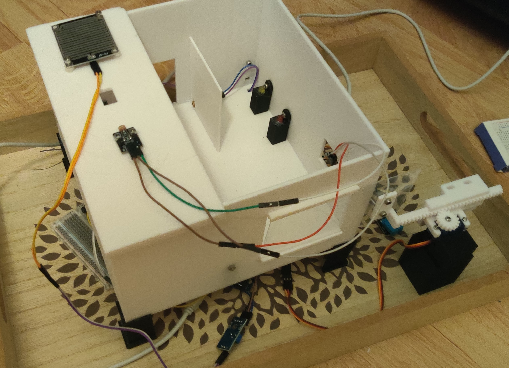

# SmartLink: Integrated Home Automation System

[](https://www.arduino.cc/)
[](https://isocpp.org/)

## Overview

**SmartLink** is a comprehensive IoT-based home automation solution developed on the **Arduino Mega** platform. The system bridges the gap between hardware sensors and user control, allowing for real-time monitoring and autonomous management of a domestic environment. 


*Figure 1: SmartLink hardware core featuring sensor integration and automated environmental control logic.*

The firmware manages everything from climate control (heating and ventilation) to smart lighting and safety protocols (automated window closing during rain), all while communicating with an external mobile application via a serial interface.


---

## Key Features

* **Intelligent Climate Management:** Monitors indoor and outdoor temperatures to automatically trigger heating or open windows for ventilation.
* **Weather-Responsive Safety:** Integrated rain sensor logic that overrides manual commands to close windows immediately upon detecting moisture.
* **Dual-Zone Smart Lighting:**
    * **Outdoor:** Motion-activated (PIR) and luminosity-dependent.
    * **Indoor:** Laser-tripwire logic for human presence detection with automated timers.
* **Two Operating Modes:**
    * **Manual Mode:** Full control of every LED and the servo-window via external serial commands.
    * **Auto Mode:** A sensor-driven state machine that manages the home based on pre-defined environmental thresholds.
* **Telemetry Stream:** Constant data uplink providing temperature, humidity, and weather status in a structured format.

---

## Hardware Configuration

| Component | Description | Pin Connection |
| :--- | :--- | :--- |
| **Microcontroller** | Arduino Mega 2560 | Master Controller |
| **Internal Temp** | DS18B20 (OneWire) | Pin 12 |
| **External Temp/Hum** | DHT11 | Pin 52 |
| **Window Actuator** | MG995/SG90 Servo | Pin 50 |
| **Motion Sensor** | PIR HC-SR501 | Pin 38 |
| **Rain Sensor** | Analog Capacitive/Resistive | Pin A0 |
| **Light Sensor (Ext)** | Photoresistor (LDR) | Pin A2 |
| **Light Sensor (Int)** | Laser/LDR Pair | Pin A1 |
| **Communication** | SoftwareSerial Bridge | Pins 10 (RX), 11 (TX) |

---

## Logic & Thresholds

The system's **Autonomous Mode** operates based on the following logic gates:

* **Ventilation:** Window opens if $Temp_{int} \geq 24^{\circ}C$ (only if no rain is detected).
* **Heating:** Activates when $Temp_{int} < 18.5^{\circ}C$ and shuts off once it reaches $22^{\circ}C$ to ensure energy efficiency.
* **Safety:** The window is forced to a "Closed" state if the rain sensor value detects moisture (threshold $\leq 650$).
* **Indoor Lighting:** Uses a laser-break detection logic. If the beam is obstructed, lights activate for a 10-second window.

---

## Command Protocol

The system communicates via **Serial1** at 9600 baud. Data is sent to the application as a string delimited by pipes (`|`):

`Temp_Int | Temp_Ext | Hum_Ext | Rain_Status`

### Manual Overrides
The following byte commands are supported:
* **17 / 16:** Switch to Auto Mode / Switch to Manual Mode.
* **15 / 14:** Open Window / Close Window.
* **13 / 12:** Heating ON / OFF.
* **9 / 8:** External LED 1 ON / OFF.
* **3 / 2:** Saloon LED 1 ON / OFF.

---

## Project Structure

```text
SmartLink-Home-Automation/
│
├── SmartHome_Firmware/
│   └── SmartHome_Firmware.ino   # Main logic and state machine
│
├── Assets/
│   └── circuit_diagram.png      # Hardware wiring schematics
│
└── README.md
